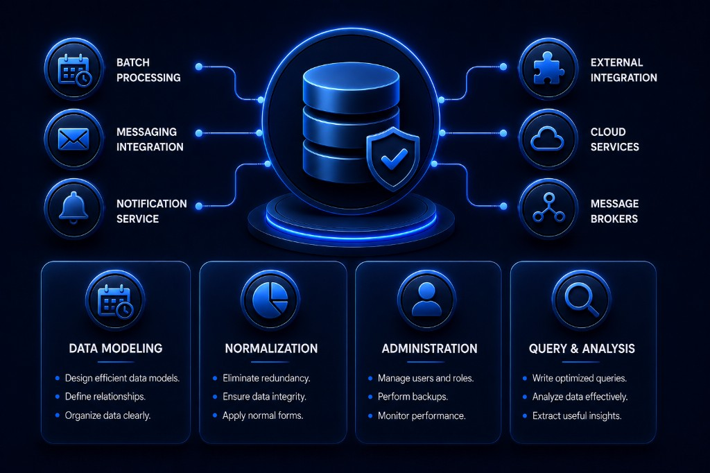

 

    
    

##   Databases

 

Central repository for SQL/NoSQL database projects: database modeling and schema design, normalization, relationships, and data administration, applying best practices to build clear, maintainable, and scalable structures. Different Database Management System (DBMS) types are implemented, covering query, persistence, and application integration scenarios.

  

 * SQL DBMS : PostgreSQL, MySQL, SQLite, Oracle XE 21C, others.
 * NoSQL DBMS : MongoDB, others.
 * Tools : Postman, Git, Xampp, others.
 * IDEs : DBeaver, SQLDeveloper, pgAdmin, others.

  
 
  

<!------Start Index----->

## Index 📜

 
 See 

  

#### 🗂️ Projects

* [Real Estate DB (PostgreSQL) ](#db-inmobiliaria-postgresql)
  
   

* [Microelectronics DB (Oracle XE 21c) ](#db-microelectronica-oracle-xe-21c)
  
   

* [PedidosYa Shipping DB (MySQL) ](#db-pedidosya-envios-mysql)
  
   

* [Electronic Devices DB (PostgreSQL) ](#db-dispositivos-electronicos-postgresql)
  
   

* [MicroDB Mercado Libre Core (MySQL) ](#microdb-mercado-libre-core-mysql)
  
   

* [Mercado Libre Products MicroDB (MySQL) ](#microdb-mercado-libre-productos-mysql)
  
   

* [Microelectronics Microservices MicroDB (Oracle XE 21c) ](#microdb-microelectronica-microservicios-oracle-xe-21c)
  
   

* [MicroDB Cisco Devices (MySQL) ](#microdb-cisco-devices-mysql)
  
   

* [MicroDB ElectroThings (MongoDB) ](#microdb-electrothings-mongodb)
  
   

* [DB Supermercado (PostgreSQL) ](#db-supermercado-postgresql)
  
   

* [MicroDB Productos Supermercado (PostgreSQL) ](#microdb-productos-supermercado-postgresql)
  
   

* [Real Estate Microservices MicroDB (PostgreSQL) ](#microdb-inmobiliaria-microservicios-postgresql)
  
   

* [Apparel DB (MySQL) ](#db-indumentaria-mysql)
  
   

 

<!------Stop Index----->
  
  
 
  

    
  ## 🗂️ Projects

 

<!------Start db_Inmobiliaria_PostgreSQL----->

### Real Estate DB (PostgreSQL) 

   

 

### Details

<!------End db_Inmobiliaria_PostgreSQL----->

 
 
 
 

<!------Start db_microelectronica_Oracle----->

### Microelectronics DB (Oracle XE 21c) 

   

 

### Details

<!------End db_microelectronica_Oracle----->

 
 
 
 

<!------Start db_PedidosYaEnvios_MySQL----->

### PedidosYa Shipping DB (MySQL) 

   

 

### Details

<!------End db_PedidosYaEnvios_MySQL----->

 
 
 
 

<!------Start db_dispositivos_electronicos_postgreSQL----->

### Electronic Devices DB (PostgreSQL) 

   

 

### Details

<!------End db_dispositivos_electronicos_postgreSQL----->

 
 
 
 

<!------Start Microdb_MercadoLibre_Mysql----->

### MicroDB Mercado Libre Core (MySQL) 

   

 

### Details

<!------End Microdb_MercadoLibre_Mysql----->

 
 
 
 

<!------Start Microdb_MercadoLibre_Productos----->

### Mercado Libre Products MicroDB (MySQL) 

   

 

### Details

<!------End Microdb_MercadoLibre_Productos----->

 
 
 
 

<!------Start Microdb_Microelectronica_OracleXE----->

### Microelectronics Microservices MicroDB (Oracle XE 21c) 

   

 

### Details

<!------End Microdb_Microelectronica_OracleXE----->

 
 
 
 

<!------Start Microdb_Cisco_Devices_Mysql----->

### MicroDB Cisco Devices (MySQL) 

   

 

### Details

<!------End Microdb_Cisco_Devices_Mysql----->

 
 
 
 

<!------Start Microdb_ElectroThings_MongoDB----->

### MicroDB ElectroThings (MongoDB) 

   

 

### Details

<!------End Microdb_ElectroThings_MongoDB----->

 
 
 
 

<!------Start db_Supermercado_PostgreSQL----->

### DB Supermercado (PostgreSQL) 

   

 

### Details

<!------End db_Supermercado_PostgreSQL----->

 
 
 
 

<!------Start Microdb_Productos_Supermercado_PostgreSQL----->

### MicroDB Productos Supermercado (PostgreSQL) 

   

 

### Details

<!------End Microdb_Productos_Supermercado_PostgreSQL----->

 
 
 
 

<!------Start Microdb_Inmobiliaria_Microservicios_PostgreSQL----->

### Real Estate Microservices MicroDB (PostgreSQL) 

   

 

### Details

<!------End Microdb_Inmobiliaria_Microservicios_PostgreSQL----->

 
 
 
 

<!------Start db_Indumentaria_MySQL----->

### Apparel DB (MySQL) 

   

 

### Details

<!------End db_Indumentaria_MySQL----->

 
 
 
 
